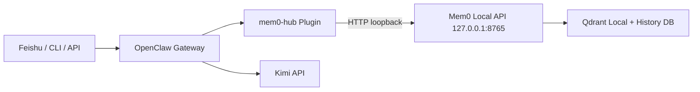
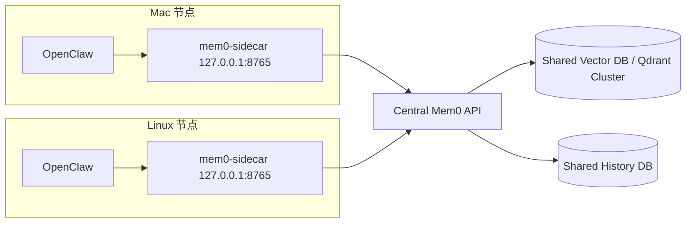
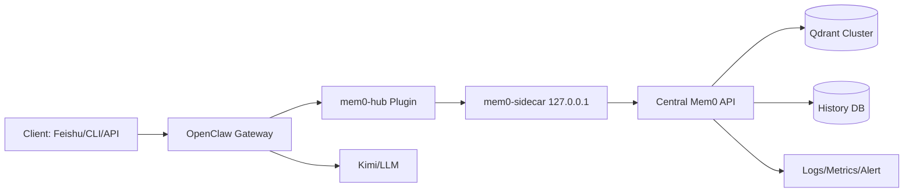

# OpenClaw + Mem0 第一记忆源改造手册（含 Kimi、飞书长连接、多环境共享记忆）

<p align="center">
  
  
  
  
  
</p>

> 一份可以直接开源发布的实战教程：从 0 部署 OpenClaw + Mem0，到“强制记忆检索 + 自动回写”闭环，再到 Mac/Linux 多实例共享同一记忆库。

> 时间基准：2026-03-13（本文所有命令与版本按该日期实测）。

> ⚠️ 风险声明：仓库的一键脚本是加速器，不是全平台全版本验证后的银弹。已有生产环境的用户必须先备份，再执行改造。

---

## 目录

- [1. 项目目标](#1-项目目标)
- [2. 你最终会得到什么](#2-你最终会得到什么)
- [3. 架构设计](#3-架构设计)
- [4. 环境基线与目录规范](#4-环境基线与目录规范)
- [5. Step-by-Step 部署](#5-step-by-step-部署)
- [6. 把 Mem0 变成第一记忆执行原则](#6-把-mem0-变成第一记忆执行原则)
- [7. 多环境共享记忆（Mac + Linux）](#7-多环境共享记忆mac--linux)
- [8. 端到端验收](#8-端到端验收)
- [9. 实战踩坑与修复](#9-实战踩坑与修复)
- [10. 资源优化与高性能扩展](#10-资源优化与高性能扩展)
- [11. 安全与开源发布建议](#11-安全与开源发布建议)
- [12. 一键排障清单](#12-一键排障清单)
- [13. FAQ](#13-faq)
- [14. 开源维护建议](#14-开源维护建议)
- [15. 许可证与贡献](#15-许可证与贡献)

---

## 1. 项目目标

把 OpenClaw 从“会话级记忆”改造成“Mem0 为唯一主记忆源”的执行系统。

硬性目标：

1. 用户输入一到达 OpenClaw，立刻异步写入 Mem0（语义提炼后存储）。
2. 每一轮模型调用前，必须先检索 Mem0。
3. 检索结果必须注入到上下文顶部，格式固定为 `[历史记忆：...]`。
4. 模型回复后，自动把“用户问题 + AI 回答”回写 Mem0。
5. 避免 old memory tool 干扰，彻底禁用 `memory_search/memory_get/memory_add` 旧路径。

---

## 2. 你最终会得到什么

部署完成后，系统具备以下能力：

- 飞书长连接消息可直接进入 OpenClaw。
- Mem0 使用 `BAAI/bge-large-zh-v1.5` 进行中文向量化。
- LLM 使用 Kimi（`kimi-k2.5`）。
- `/new` 后不会丢记忆，仍可从 Mem0 召回历史事实。
- 在低内存机器可稳定运行，同时支持高性能扩展架构。
- 可扩展成多节点（macOS + Linux）共享一个中心记忆库。

---

## 3. 架构设计

### 3.1 单机低延迟架构（当前落地）



说明：

- OpenClaw 调 Mem0 强制走 `http://127.0.0.1:<port>`。
- 避免公网路径，降低延迟和流量成本。

### 3.2 多环境共享记忆架构（macOS + Linux）



核心点：

- 每台机器上的 OpenClaw 仍只访问本机 `127.0.0.1`（满足“本地访问约束”）。
- 通过 sidecar 把请求转发到中心 Mem0，实现跨设备共享记忆。
- 共享是否成功的关键不是网络，而是 `user_id` 统一策略（第 7 章详细说明）。

### 3.3 生产稳态架构（推荐）



设计要点：

1. `OpenClaw -> sidecar` 固定本地 loopback，降低部署差异。
2. `sidecar -> central mem0` 统一做鉴权、重试、超时和熔断。
3. 向量库与历史库独立部署，避免互相拖慢。
4. 加可观测性（检索命中率、写入失败率、user_id 漂移告警）。

---

## 4. 环境基线与目录规范

### 4.1 版本基线（实测）

```bash
node -v                 # v22.12.0
npm -v                  # 10.9.0
python3 --version       # Python 3.12.3
```

OpenClaw 版本：

```bash
cd /root/openclaw-work/extracted/package
/usr/local/bin/node ./openclaw.mjs --no-color --version
# OpenClaw 2026.3.11 (29dc654)
```

Mem0 版本：

```bash
cd /root/mem0-local
./.venv/bin/python -c "import mem0; print(mem0.__version__)"
# 1.0.5
```

### 4.2 目录规划（建议按此执行）

- OpenClaw 运行目录：`/root/openclaw-work/extracted/package`
- OpenClaw 主配置：`/root/.openclaw/openclaw.json`
- Mem0 服务目录：`/root/mem0-local`
- Mem0 API 文件：`/root/mem0-local/mem0_api.py`
- 插件目录：`/root/.openclaw/extensions/mem0-hub`
- 部署脚本目录：`/root/openclaw-work/deploy`
- 跨平台一键脚本：`deploy/linux/one_click.sh`、`deploy/macos/one_click.sh`、`deploy/windows/one_click.ps1`
- 模板目录：`deploy/common/*`、`templates/mem0-hub/index.ts`

---

## 5. Step-by-Step 部署

## 5.0 跨平台一键脚本（推荐入口）

> ⚠️ 注意：脚本未覆盖所有系统组合与 OpenClaw 版本。线上环境优先使用“备份 + AI 代理分步执行”。

### 5.0.1 执行前先备份（强烈建议）

Linux/macOS：

```bash
set -euo pipefail
TS="$(date +%Y%m%d-%H%M%S)"
BK_DIR="$HOME/openclaw-backup-$TS"
mkdir -p "$BK_DIR"
[ -d "$HOME/.openclaw" ] && cp -a "$HOME/.openclaw" "$BK_DIR/.openclaw"
[ -d "$HOME/mem0-local" ] && cp -a "$HOME/mem0-local" "$BK_DIR/mem0-local"
echo "backup done: $BK_DIR"
```

Windows PowerShell：

```powershell
$ts = Get-Date -Format "yyyyMMdd-HHmmss"
$bk = "$env:USERPROFILE\\openclaw-backup-$ts"
New-Item -ItemType Directory -Force -Path $bk | Out-Null
if (Test-Path "$env:USERPROFILE\\.openclaw") { Copy-Item -Recurse -Force "$env:USERPROFILE\\.openclaw" "$bk\\.openclaw" }
if (Test-Path "$env:USERPROFILE\\mem0-local") { Copy-Item -Recurse -Force "$env:USERPROFILE\\mem0-local" "$bk\\mem0-local" }
Write-Host "backup done: $bk"
```

### 5.0.2 推荐傻瓜流程：给 Codex/Claude Code 的提示词

```text
请以“最小风险”方式把当前 OpenClaw 改造成 Mem0 First。
严格按以下顺序执行并输出每一步结果：
1) 先检查并备份：~/.openclaw、mem0-local、openclaw-work（若存在）
2) 阅读 README.md、deploy/README.md、OPENCLAW_MEM0_部署与记忆优化全流程手册.md
3) 不直接盲跑一键脚本；先 dry-run 说明将修改哪些文件
4) 再执行对应系统脚本（linux/macos/windows）
5) 校验 openclaw.json、mem0_api.py、mem0-hub/index.ts 是否已正确注入
6) 执行 /health、memory/add、memory/search 验收
7) 给出回滚命令（基于备份目录）
8) 按严重程度输出问题和修复建议
```

如果你希望直接“一键部署 + 自动改造 OpenClaw 底层记忆链路”，优先使用以下脚本：

1. Linux：`deploy/linux/one_click.sh`
2. macOS：`deploy/macos/one_click.sh`
3. Windows：`deploy/windows/one_click.ps1`

脚本会自动执行：

1. 部署 Mem0 Local API（`mem0_api.py` + Python 依赖）
2. 注入 `mem0-hub` 插件（`~/.openclaw/extensions/mem0-hub/index.ts`）
3. 自动补丁 `~/.openclaw/openclaw.json`
4. 启动服务（Linux 用 systemd，macOS/Windows 生成启动脚本）

Linux 快速执行：

```bash
git clone https://github.com/iqvpi1024/openclaw-mem0.git
cd openclaw-mem0
chmod +x deploy/linux/one_click.sh
KIMI_API_KEY="<YOUR_KIMI_API_KEY>" OPENCLAW_PACKAGE_DIR="/abs/path/to/openclaw/package" bash deploy/linux/one_click.sh
```

macOS 快速执行：

```bash
git clone https://github.com/iqvpi1024/openclaw-mem0.git
cd openclaw-mem0
chmod +x deploy/macos/one_click.sh
KIMI_API_KEY="<YOUR_KIMI_API_KEY>" OPENCLAW_PACKAGE_DIR="/abs/path/to/openclaw/package" bash deploy/macos/one_click.sh
```

Windows 快速执行（PowerShell）：

```powershell
git clone https://github.com/iqvpi1024/openclaw-mem0.git
cd openclaw-mem0
powershell -ExecutionPolicy Bypass -File .\deploy\windows\one_click.ps1 -OpenClawPackageDir "C:\path\to\openclaw\package" -KimiApiKey "<YOUR_KIMI_API_KEY>"
```

## 5.1 可选：创建 4GB Swap（低内存机器建议）

目标：防止 embedding 首次加载和并发阶段 OOM。

脚本文件：`/root/openclaw-work/deploy/ensure_swap_4g.sh`

```bash
#!/usr/bin/env bash
set -euo pipefail

TARGET_MB=4096
CURRENT_MB=$(swapon --show=SIZE --bytes --noheadings | awk '{sum+=$1} END {print int(sum/1024/1024)}')
CURRENT_MB=${CURRENT_MB:-0}

if [ "$CURRENT_MB" -ge "$TARGET_MB" ]; then
  echo "Swap already enough: ${CURRENT_MB}MB"
  exit 0
fi

NEED_MB=$((TARGET_MB - CURRENT_MB))
SWAP_FILE=/swap.openclaw

echo "Create swap: ${NEED_MB}MB -> ${SWAP_FILE}"
rm -f "$SWAP_FILE"
fallocate -l "${NEED_MB}M" "$SWAP_FILE"
chmod 600 "$SWAP_FILE"
mkswap "$SWAP_FILE"
swapon "$SWAP_FILE"

grep -q "${SWAP_FILE}" /etc/fstab || echo "${SWAP_FILE} none swap sw 0 0" >> /etc/fstab
swapon --show
```

systemd：`/etc/systemd/system/ensure-swap-4g.service`

```ini
[Unit]
Description=Ensure at least 4GB swap exists
DefaultDependencies=no
Before=multi-user.target openclaw-gateway.service mem0-local.service
After=local-fs.target

[Service]
Type=oneshot
ExecStart=/bin/bash /root/openclaw-work/deploy/ensure_swap_4g.sh
RemainAfterExit=yes

[Install]
WantedBy=multi-user.target
```

启用：

```bash
systemctl daemon-reload
systemctl enable --now ensure-swap-4g.service
systemctl status ensure-swap-4g.service
free -h
swapon --show
```

## 5.2 部署 OpenClaw Gateway

systemd 文件：`/etc/systemd/system/openclaw-gateway.service`

```ini
[Unit]
Description=OpenClaw Gateway (local)
After=network-online.target ensure-swap-4g.service
Wants=network-online.target ensure-swap-4g.service

[Service]
Type=simple
User=root
WorkingDirectory=/root/openclaw-work/extracted/package
Environment=NODE_COMPILE_CACHE=/var/tmp/openclaw-compile-cache
Environment=OPENCLAW_NO_RESPAWN=1
ExecStartPre=/usr/bin/mkdir -p /var/tmp/openclaw-compile-cache
ExecStart=/usr/local/bin/node ./openclaw.mjs --no-color gateway run
Restart=always
RestartSec=5
LimitNOFILE=65535

[Install]
WantedBy=multi-user.target
```

启用：

```bash
systemctl daemon-reload
systemctl enable --now openclaw-gateway.service
systemctl status openclaw-gateway.service
```

## 5.3 部署 Mem0 Local API（BGE 中文向量）

在 `/root/mem0-local`：

```bash
python3 -m venv .venv
source .venv/bin/activate
pip install -U pip
cat > requirements.txt <<'REQ'
mem0ai==1.0.5
fastapi==0.135.1
uvicorn[standard]==0.41.0
python-dotenv==1.2.2
sentence-transformers==5.1.2
REQ
pip install -r requirements.txt
```

环境变量 `/root/mem0-local/.env`：

```env
# 通过 OpenClaw 网关使用上游模型
OPENAI_API_KEY=openclaw-local
OPENAI_BASE_URL=http://127.0.0.1:18789/v1

# LLM provider（语义提炼）
MEM0_LLM_PROVIDER=openai
MEM0_LLM_MODEL=kimicode/kimi-k2.5

# Embedding model（中文）
MEM0_EMBEDDER_PROVIDER=huggingface
MEM0_EMBEDDER_MODEL=BAAI/bge-large-zh-v1.5
MEM0_EMBEDDING_DIMS=1024
HF_ENDPOINT=https://hf-mirror.com

# Storage
MEM0_QDRANT_PATH=./data/qdrant-openclaw-v2
MEM0_HISTORY_DB_PATH=./data/history-openclaw-v2.db
MEM0_COLLECTION_NAME=mem0
```

`/root/mem0-local/mem0_api.py` 最低接口要求：

- `GET /health`
- `POST /memory/add`
- `POST /memory/search`
- `GET /memory/all/{user_id}`

建议增强逻辑：

1. `infer=true` 无法提炼 facts 时，自动 fallback `infer=false` 原文落库。
2. 遇到 `readonly database` 时做二次 `search` 验证，避免误判失败。
3. 统一输出结构化日志，便于用 `journalctl` 检查链路。

systemd 文件：`/etc/systemd/system/mem0-local.service`

```ini
[Unit]
Description=Mem0 Local API (loopback)
After=network-online.target openclaw-gateway.service ensure-swap-4g.service
Wants=network-online.target openclaw-gateway.service ensure-swap-4g.service

[Service]
Type=simple
User=root
WorkingDirectory=/root/mem0-local
EnvironmentFile=/root/mem0-local/.env
Environment=PYTHONUNBUFFERED=1
ExecStart=/root/mem0-local/.venv/bin/uvicorn mem0_api:app --host 127.0.0.1 --port 8765 --workers 1
Restart=always
RestartSec=5

[Install]
WantedBy=multi-user.target
```

启用：

```bash
systemctl daemon-reload
systemctl enable --now mem0-local.service
systemctl status mem0-local.service
curl -s http://127.0.0.1:8765/health
```

## 5.4 OpenClaw 配置：Kimi + 飞书长连接 + 低并发

文件：`/root/.openclaw/openclaw.json`

### 模型（Kimi）

```json
"models": {
  "providers": {
    "kimicode": {
      "baseUrl": "https://api.kimi.com/coding",
      "apiKey": "<YOUR_KIMI_API_KEY>",
      "api": "anthropic-messages",
      "models": [
        {
          "id": "kimi-k2.5",
          "name": "Kimi K2.5",
          "reasoning": false,
          "input": ["text"],
          "cost": {
            "input": 0,
            "output": 0,
            "cacheRead": 0,
            "cacheWrite": 0
          },
          "contextWindow": 256000,
          "maxTokens": 8192
        }
      ]
    }
  }
}
```

### 默认 Agent 并发限制（稳态优先）

```json
"agents": {
  "defaults": {
    "model": {
      "primary": "kimicode/kimi-k2.5",
      "fallbacks": []
    },
    "maxConcurrent": 1,
    "subagents": {
      "maxConcurrent": 1
    }
  }
}
```

### 飞书长连接

```json
"channels": {
  "feishu": {
    "enabled": true,
    "connectionMode": "websocket",
    "defaultAccount": "main",
    "accounts": {
      "main": {
        "enabled": true,
        "appId": "<FEISHU_APP_ID>",
        "appSecret": "<FEISHU_APP_SECRET>",
        "domain": "feishu"
      }
    }
  }
}
```

### 禁用旧记忆工具（关键）

```json
"tools": {
  "deny": [
    "group:memory",
    "memory_search",
    "memory_get",
    "memory_add"
  ],
  "media": {
    "concurrency": 1
  }
}
```

### 本地网关

```json
"gateway": {
  "port": 18789,
  "mode": "local",
  "bind": "loopback",
  "auth": {
    "mode": "none"
  }
}
```

生产环境请改为 token/password，不建议长期 `auth:none`。

---

## 6. 把 Mem0 变成第一记忆执行原则

这是本改造最关键部分：不是“可选记忆”，而是“强制记忆”。

插件文件：`/root/.openclaw/extensions/mem0-hub/index.ts`

## 6.1 强制本地 Mem0 URL 规则

实现 `ensureLocalMem0Url()`：

- 协议必须为 `http://`
- 主机必须为 `127.0.0.1`
- 必须显式端口

目的：

- 保证本机调用链稳定
- 禁止误走公网 URL

## 6.2 Hook 顺序与职责

### Hook 1: `message_received`

- 输入消息到达即异步 `POST /memory/add`
- `infer=true`
- 附加语义提炼提示词：提取偏好、事实、任务规则、硬约束

### Hook 2: `before_prompt_build`

- 提取本轮用户 Prompt
- `POST /memory/search`
- 把结果插入系统上下文顶部：`[历史记忆：...]`

### Hook 3: `agent_end`

- 将 `用户问题 + AI回答` 再次写入 Mem0
- 形成持续学习闭环

### Hook 4: `before_tool_call`

- 拦截/拒绝 `memory_search/memory_get/memory_add`
- 彻底切断旧记忆路径

### Hook 5: `message_sending`

- 清理错误叙述（例如“Mem0 不可用，请去写 USER.md”）

## 6.3 `/new` 后不丢记忆的根因与修复

问题根因：

- 新会话后，检索 `user_id` 有时漂移成 `session:agent:*`
- 导致检索不到原用户的真实记忆

修复策略：

1. 维护 `session/conversation -> sender_id` 绑定缓存。
2. 在 prompt 中兜底解析 `sender_id` 回填绑定。
3. 始终优先使用 `ingress:feishu:sender:<id>` 作为检索 user_id。

结论：

- `/new` 只重置上下文，不重置 Mem0。
- 只要 user_id 稳定，检索就稳定。

## 6.4 插件挂载方式（易错点）

```json
"plugins": {
  "allow": ["mem0-hub", "feishu"],
  "load": {
    "paths": ["/root/.openclaw/extensions/mem0-hub"]
  },
  "slots": {
    "memory": "none"
  },
  "entries": {
    "mem0-hub": {
      "enabled": true,
      "config": {
        "mem0Url": "http://127.0.0.1:8765",
        "searchLimit": 5,
        "addTimeoutMs": 30000,
        "searchTimeoutMs": 20000,
        "semanticPrompt": "请提炼输入中的核心知识点、用户偏好、任务规则和关键约束，形成可长期检索的简洁记忆。"
      }
    }
  }
}
```

注意：`mem0-hub` 不是 OpenClaw memory-slot 类型插件，所以 `plugins.slots.memory` 必须是 `none`。

---

## 7. 多环境共享记忆（Mac + Linux）

你问的这个结论是对的：

- 只要多个 OpenClaw 实例指向同一个 Mem0 后端，并且 `user_id` 统一，就可以共享同一记忆。

但必须满足 4 个条件：

1. 所有实例使用同一 Mem0 存储后端（同一个向量库 + 历史库）。
2. 所有实例使用一致的 embedding 模型版本（这里是 `BAAI/bge-large-zh-v1.5`）。
3. 所有实例使用一致的 `user_id` 归一化规则。
4. 所有实例检索和写入走相同 namespace / tenant 规则。

## 7.1 推荐方案 A（中心化 Mem0）

- 在一台 Linux 服务器部署 `Central Mem0 API` + Qdrant/DB。
- Mac 和其他 Linux 节点上的 OpenClaw 直接调用中心 Mem0。

优点：

- 架构简单。

缺点：

- 需放开 `127.0.0.1` 限制，改为内网地址（例如 `10.x.x.x`）。

## 7.2 推荐方案 B（本地 Sidecar + 中心 Mem0，推荐）

- 每个节点部署本地 `mem0-sidecar`（监听 `127.0.0.1:8765`）。
- sidecar 再转发到中心 Mem0（内网专线/mTLS）。
- OpenClaw 永远只访问本地 `127.0.0.1`。

优点：

- 保留你要求的“本地 loopback 强制策略”。
- 多环境共享记忆。
- 可逐节点灰度。

## 7.3 user_id 统一方案（决定共享成败）

推荐统一 ID 模式：

```text
tenant:<tenant_id>:user:<global_user_id>
```

映射示例：

- 飞书 `ou_xxx` -> `tenant:acme:user:user001`
- 终端账号 `dev@mac` -> `tenant:acme:user:user001`
- Web 登录 uid `10086` -> `tenant:acme:user:user001`

不要直接把渠道 ID 当最终 user_id，应该先经过“身份映射表”。

## 7.4 多实例一致性建议

1. 写入策略：主流程异步写入 + 失败重试队列。
2. 去重策略：对 `(global_user_id, normalized_text_hash, day_bucket)` 做弱去重。
3. 检索策略：top-k 不宜过大（建议 3~8）。
4. 回写策略：只回写关键信息（避免把噪声对话全部沉淀）。

## 7.5 跨平台部署最小步骤

1. 先部署中心 Mem0（Linux）。
2. 在 Mac/Linux OpenClaw 节点部署 sidecar。
3. 节点 `mem0-hub` 保持 `mem0Url=http://127.0.0.1:8765`。
4. sidecar 配置中心 URL，例如 `https://mem0.internal.example.com`。
5. 配置统一身份映射服务或静态映射表。
6. 用同一用户分别在 Mac 与 Linux 发消息，验证互相可召回记忆。

---

## 8. 端到端验收

## 8.1 服务启动

```bash
systemctl restart ensure-swap-4g.service
systemctl restart openclaw-gateway.service
systemctl restart mem0-local.service

systemctl is-active ensure-swap-4g.service openclaw-gateway.service mem0-local.service
```

期望全部 `active`。

## 8.2 Mem0 自检

```bash
curl -s http://127.0.0.1:8765/health
curl -s -X POST http://127.0.0.1:8765/memory/add \
  -H 'content-type: application/json' \
  -d '{"user_id":"diag-001","text":"我的昵称是测试用户A","infer":false}'

curl -s -X POST http://127.0.0.1:8765/memory/search \
  -H 'content-type: application/json' \
  -d '{"user_id":"diag-001","query":"我的昵称是什么","limit":5}'
```

## 8.3 飞书验收脚本

按顺序发送：

1. `/new`
2. `我叫测试用户A，我在做一个自动化项目`
3. `我的项目代号是 Orion，默认回复中文`
4. `我项目代号是什么？默认回复什么语言？`

预期：

- 能答出项目代号。
- 能答出默认回复语言。
- Mem0 日志有 `message_received -> search -> agent_end` 三段链路。

---

## 9. 实战踩坑与修复

## 9.1 `node:sqlite` 报错

错误：

- `SQLite support is unavailable in this Node runtime (missing node:sqlite)`

解释：

- 这是旧内置记忆工具链的报错，不是 Mem0 API 本身不可用。

修复：

- 禁用旧 memory 工具组。
- 只保留 mem0-hub + /memory/* API 路径。

## 9.2 模型口头说“Mem0 不可用”

现象：

- 工具禁用后，模型可能 hallucination 出“Mem0 不可用”。

修复：

1. `before_prompt_build` 注入硬规则。
2. `message_sending` 对错误措辞做最终清理。

## 9.3 `plugins.slots.memory` 配错

错误：

- `memory slot plugin not found or not marked as memory: mem0-hub`

修复：

- `plugins.slots.memory` 必须 `none`。
- `mem0-hub` 作为普通扩展加载。

## 9.4 配置校验失败：`addTimeoutMs` 超上限

错误：

- `addTimeoutMs must be <= 30000`

修复：

- 改为 `30000` 或更低。

## 9.5 首次模型加载超时 / AbortError

修复：

- 保持 `workers=1`
- 增加 swap
- 预热 embedding（启动后先做一次 add/search）

## 9.6 `readonly database` 偶发

修复：

- API 内二次 search 兜底确认。
- 校验目录权限和磁盘挂载状态。
- 必要时重启 mem0-local。

## 9.7 `/new` 后像失忆

修复：

- 统一并固化 `user_id` 绑定，不使用易漂移 session id。

---

## 10. 资源优化与高性能扩展

### 10.1 稳态运行建议（通用）

1. OpenClaw 并发：`maxConcurrent=1`（先保证稳定）。
2. Mem0 uvicorn workers：`1`（避免资源争抢）。
3. 工具并发和媒体并发限制为 `1`。
4. 启动顺序建议：OpenClaw -> Mem0。
5. 若机器内存较小，启用 Swap（例如 4GB）。

### 10.2 高性能部署方案（本地向量模型升级）

目标：提升检索质量与吞吐，保持“Mem0 第一记忆源”主链路不变。

推荐路线：

1. Embedding 模型升级：
- 默认稳定：`BAAI/bge-large-zh-v1.5`
- 高性能推荐：`BAAI/bge-m3`（多语种、长文本场景更优）

2. 服务拆分：
- OpenClaw（推理编排）
- Mem0 API（记忆编排）
- 向量数据库（Qdrant 独立节点）
- Embedding 推理服务（可独立 CPU/GPU 部署）

3. 配置建议：
- `searchLimit` 建议 `5~8`
- 增加检索结果去重/截断，减少噪声注入
- 对写入和检索设置独立超时与重试策略

4. 示例（切换至 `bge-m3`）：

```env
MEM0_EMBEDDER_PROVIDER=huggingface
MEM0_EMBEDDER_MODEL=BAAI/bge-m3
MEM0_EMBEDDING_DIMS=1024
```

---

## 11. 安全与开源发布建议

## 11.1 必做安全项

1. 轮换 API 密钥（Kimi、飞书）。
2. 使用环境变量，不把密钥写进仓库。
3. 网关鉴权改为 token/password。
4. 对 Mem0 API 增加内网 ACL 或反向代理认证。

## 11.2 开源前敏感信息检查

执行：

```bash
rg -n "sk-|appSecret|apiKey|token|password|AKIA|PRIVATE KEY" .
```

确保：

- 文档里只有 `<PLACEHOLDER>`。
- 代码里不出现真实密钥。
- 提交前清理 shell history 中可能泄露内容。

---

## 12. 一键排障清单

```bash
# 1) 服务状态
systemctl is-active ensure-swap-4g.service openclaw-gateway.service mem0-local.service

# 2) Mem0 健康
curl -s http://127.0.0.1:8765/health

# 3) OpenClaw 配置是否合法
cd /root/openclaw-work/extracted/package
/usr/local/bin/node ./openclaw.mjs --no-color config validate

# 4) 是否误调用旧记忆工具
journalctl -u openclaw-gateway.service -n 300 --no-pager | rg -n "memory_search|memory_get|blocked legacy"

# 5) 指定用户是否有记忆
curl -s "http://127.0.0.1:8765/memory/all/ingress:feishu:sender:<sender_id>"

# 6) 最近错误
journalctl -u openclaw-gateway.service -n 200 --no-pager
journalctl -u mem0-local.service -n 200 --no-pager
```

---

## 13. FAQ

### Q1: Mem0 是不是天然支持多端共享？

是，但前提是你让多个实例访问同一后端并统一 `user_id`。如果每台机器各写各的本地数据库，就不会共享。

### Q2: `/new` 之后为什么有时像失忆？

通常是检索 user_id 变了，不是 Mem0 数据没了。统一 user_id 映射后即可恢复。

### Q3: 我还需要 SOUL.md / USER.md 吗？

可以保留作为“静态规则文件”，但长期事实记忆应以 Mem0 为主，避免多记忆源冲突。

### Q4: 非要 127.0.0.1 才能算合规吗？

在单机部署是最佳实践。多机共享可使用 sidecar，让 OpenClaw 依然只访问本机 127，再由 sidecar 转发。

---

## 14. 开源维护建议

建议按以下顺序维护仓库质量：

1. 发布版本标签：按 `vX.Y.Z` 打 tag，并在 Release 写清兼容的 OpenClaw 版本。
2. 固定依赖版本：`deploy/common/requirements.txt` 与脚本中的关键版本保持同步。
3. 自动脱敏检查：CI 中增加 `rg` 规则，阻断明文密钥提交。
4. 最小化破坏更新：对 `patch_openclaw_config.mjs` 变更必须附兼容说明。
5. 常见问题回归：每次改动后跑 `memory/add + memory/search + /new` 三段验证。
6. 多平台回归：至少在 Linux/macOS 上验证一键脚本，Windows 脚本保持参数一致性。

---

## 15. 许可证与贡献

## 15.1 License

默认建议：MIT。

```text
MIT License
```

## 15.2 Contributing

建议仓库补充：

- `CONTRIBUTING.md`
- `SECURITY.md`
- `CODE_OF_CONDUCT.md`

---

## 附录 A：敏感信息占位模板

请确保仓库中只出现占位符：

- `<YOUR_KIMI_API_KEY>`
- `<FEISHU_APP_ID>`
- `<FEISHU_APP_SECRET>`
- `<MEM0_API_TOKEN>`

---

## 附录 B：最终验收标准（上线前逐条勾选）

1. `/new` 后仍能召回历史记忆。
2. 每轮都有 `search + add` 双向链路日志。
3. 不再出现“请改 USER.md 才能记忆”的回复。
4. openclaw、mem0、swap 三个服务均 `active` 且开机自启。
5. 配置与仓库内无明文密钥。
6. 若启用多节点，共享用户在不同设备能互相召回同一记忆。
