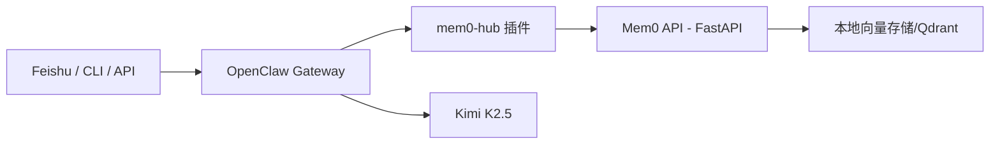
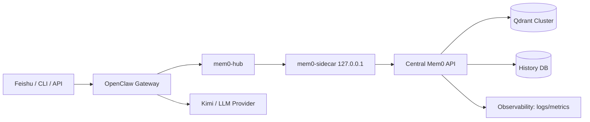

# OpenClaw-Mem0: OpenClaw 记忆增强终极方案（Mem0 First）

<p align="center">
  <a href="https://github.com/iqvpi1024/openclaw-mem0/stargazers">
    
  </a>
  <a href="https://github.com/iqvpi1024/openclaw-mem0/network/members">
    
  </a>
  <a href="https://github.com/iqvpi1024/openclaw-mem0/blob/main/LICENSE">
    
  </a>
  
  
</p>

> 一句话：把 OpenClaw 从“会话记忆”升级成“Mem0 第一记忆源”，让记忆检索和回写变成后端强制动作。

> ⚠️ 安全声明：仓库中的跨平台一键脚本尚未在所有系统组合上做全量回归（尤其是不同版本的 OpenClaw / Windows 环境）。
> 生产环境建议优先使用“备份 + AI 代理按步骤执行”的方式落地，而不是直接盲跑脚本。

## 痛点暴击

| 场景 | 传统 OpenClaw（依赖 `soul.md`/上下文） | 本项目（Mem0 第一记忆源） |
|---|---|---|
| 😵 `/new` 后连续性 | 经常像失忆，历史事实断档 | 强制先检索 Mem0，再回答 |
| 🧠 记忆持久化 | 主要靠文件或会话上下文 | 用户输入 + 模型回答双向回写 |
| 🧩 语义理解 | 文本堆积，检索弱 | 向量语义检索（`bge-large-zh-v1.5`） |
| 🔁 多端同步 | Mac / Linux / 飞书记忆割裂 | 统一 `user_id` 可跨端共享同一记忆 |
| ⚙️ 可扩展性 | 检索链路与模型链路耦合重 | 可按场景拆分为中心 Mem0 + 多节点 OpenClaw |

## 架构揭秘



## 架构优化（推荐生产版）



优化点：

1. `OpenClaw -> mem0-sidecar` 仍固定本地 `127.0.0.1`，降低链路变更风险。
2. `sidecar -> central mem0` 统一鉴权、超时、重试和熔断。
3. 向量库与历史库独立，避免单点和资源互抢。
4. 增加可观测性，定位“失忆”问题更快（检索失败、user_id 漂移、写入失败）。

核心机制：

1. 拦截 `message_received`，异步写入 Mem0（语义提炼后存储）。
2. 拦截 `before_prompt_build`，强制检索 Mem0 并注入 `[历史记忆：...]`。
3. 拦截 `agent_end`，把“用户问题 + AI回答”持续回写 Mem0。
4. 禁用旧 memory tools，避免走 `node:sqlite` 老路径。

## 为什么支持多环境共享记忆

可以实现，而且是本方案的重点能力。

前提只有 3 条：

1. 多个 OpenClaw 指向同一个 Mem0 后端（或本地 sidecar 转发到中心 Mem0）。
2. 全节点统一 embedding 模型版本（`BAAI/bge-large-zh-v1.5`）。
3. 全节点统一 `user_id` 归一化规则（例如 `tenant:acme:user:user001`）。

这样你在 Mac 说过的话，Linux 上新会话也能被召回。

## 推荐傻瓜流程（先备份，再让 AI 代理执行）

如果你已经在生产环境使用 OpenClaw，建议先备份，再执行改造。

### 1) 备份现有 OpenClaw 关键数据

Linux/macOS:

```bash
set -euo pipefail
TS="$(date +%Y%m%d-%H%M%S)"
BK_DIR="$HOME/openclaw-backup-$TS"
mkdir -p "$BK_DIR"

[ -d "$HOME/.openclaw" ] && cp -a "$HOME/.openclaw" "$BK_DIR/.openclaw"
[ -d "$HOME/mem0-local" ] && cp -a "$HOME/mem0-local" "$BK_DIR/mem0-local"
[ -d "$HOME/openclaw-work" ] && cp -a "$HOME/openclaw-work" "$BK_DIR/openclaw-work"

echo "backup done: $BK_DIR"
```

Windows PowerShell:

```powershell
$ts = Get-Date -Format "yyyyMMdd-HHmmss"
$bk = "$env:USERPROFILE\\openclaw-backup-$ts"
New-Item -ItemType Directory -Force -Path $bk | Out-Null

if (Test-Path "$env:USERPROFILE\\.openclaw") { Copy-Item -Recurse -Force "$env:USERPROFILE\\.openclaw" "$bk\\.openclaw" }
if (Test-Path "$env:USERPROFILE\\mem0-local") { Copy-Item -Recurse -Force "$env:USERPROFILE\\mem0-local" "$bk\\mem0-local" }
if (Test-Path "$env:USERPROFILE\\openclaw-work") { Copy-Item -Recurse -Force "$env:USERPROFILE\\openclaw-work" "$bk\\openclaw-work" }

Write-Host "backup done: $bk"
```

### 2) 把下面提示词直接给 Claude Code / Codex

把下面这段直接贴给你的智能编码代理（在仓库根目录执行）：

```text
请以“最小风险”方式把当前 OpenClaw 改造成 Mem0 First。
严格按以下顺序执行并输出每一步结果：
1) 先检查并备份：~/.openclaw、mem0-local、openclaw-work（若存在）
2) 读取 README.md、deploy/README.md、OPENCLAW_MEM0_部署与记忆优化全流程手册.md
3) 不直接盲跑一键脚本；先 dry-run 说明将修改哪些文件
4) 再执行对应系统脚本（linux/macos/windows）
5) 校验 openclaw.json、mem0_api.py、mem0-hub/index.ts 是否已正确注入
6) 执行 /health、memory/add、memory/search 验收
7) 给出回滚命令（基于备份目录）
8) 按严重程度输出发现的问题和修复建议
```

这是当前最稳妥、最傻瓜的落地方式。

## 一键部署（Linux / macOS / Windows）

> ⚠️ 注意：脚本是“加速器”，不是“银弹”。如果你的 OpenClaw 已上线，建议先按上面的备份+代理流程执行。

脚本会自动完成：

1. 部署 Mem0 Local API（FastAPI + 向量存储）
2. 注入 `mem0-hub` 插件到 OpenClaw 扩展目录
3. 自动改写 `openclaw.json`（强制 Mem0 First）
4. 启动服务（Linux: systemd，macOS/Windows: 运行脚本）

### Linux

```bash
git clone https://github.com/iqvpi1024/openclaw-mem0.git
cd openclaw-mem0
chmod +x deploy/linux/one_click.sh

KIMI_API_KEY="<YOUR_KIMI_API_KEY>" \
OPENCLAW_PACKAGE_DIR="/abs/path/to/openclaw/package" \
bash deploy/linux/one_click.sh
```

可选飞书：

```bash
KIMI_API_KEY="<YOUR_KIMI_API_KEY>" \
OPENCLAW_PACKAGE_DIR="/abs/path/to/openclaw/package" \
ENABLE_FEISHU=1 \
FEISHU_APP_ID="<FEISHU_APP_ID>" \
FEISHU_APP_SECRET="<FEISHU_APP_SECRET>" \
bash deploy/linux/one_click.sh
```

### macOS

```bash
git clone https://github.com/iqvpi1024/openclaw-mem0.git
cd openclaw-mem0
chmod +x deploy/macos/one_click.sh

KIMI_API_KEY="<YOUR_KIMI_API_KEY>" \
OPENCLAW_PACKAGE_DIR="/abs/path/to/openclaw/package" \
bash deploy/macos/one_click.sh
```

### Windows (PowerShell)

```powershell
git clone https://github.com/iqvpi1024/openclaw-mem0.git
cd openclaw-mem0

powershell -ExecutionPolicy Bypass -File .\deploy\windows\one_click.ps1 `
  -OpenClawPackageDir "C:\path\to\openclaw\package" `
  -KimiApiKey "<YOUR_KIMI_API_KEY>"
```

可选飞书：

```powershell
powershell -ExecutionPolicy Bypass -File .\deploy\windows\one_click.ps1 `
  -OpenClawPackageDir "C:\path\to\openclaw\package" `
  -KimiApiKey "<YOUR_KIMI_API_KEY>" `
  -EnableFeishu `
  -FeishuAppId "<FEISHU_APP_ID>" `
  -FeishuAppSecret "<FEISHU_APP_SECRET>"
```

## 脚本会自动修改的底层文件

1. `~/.openclaw/openclaw.json`
2. `~/.openclaw/extensions/mem0-hub/index.ts`
3. `~/mem0-local/mem0_api.py`（Windows 在 `%USERPROFILE%\\mem0-local`）

## 配置模板

`openclaw.json` 关键项：

```json
{
  "models": {
    "providers": {
      "kimicode": {
        "baseUrl": "https://api.kimi.com/coding",
        "apiKey": "<YOUR_KIMI_API_KEY>",
        "api": "anthropic-messages",
        "models": [{ "id": "kimi-k2.5", "contextWindow": 256000, "maxTokens": 8192 }]
      }
    }
  },
  "tools": {
    "deny": ["group:memory", "memory_search", "memory_get", "memory_add"]
  },
  "plugins": {
    "allow": ["mem0-hub", "feishu"],
    "slots": { "memory": "none" },
    "entries": {
      "mem0-hub": {
        "enabled": true,
        "config": {
          "mem0Url": "http://127.0.0.1:8765",
          "searchLimit": 5,
          "addTimeoutMs": 30000,
          "searchTimeoutMs": 20000
        }
      }
    }
  }
}
```

`mem0 .env` 关键项：

```env
OPENAI_API_KEY=<OPENCLAW_GATEWAY_KEY_OR_DUMMY>
OPENAI_BASE_URL=http://127.0.0.1:18789/v1
MEM0_LLM_PROVIDER=openai
MEM0_LLM_MODEL=kimicode/kimi-k2.5
MEM0_EMBEDDER_PROVIDER=huggingface
MEM0_EMBEDDER_MODEL=BAAI/bge-large-zh-v1.5
MEM0_EMBEDDING_DIMS=1024
MEM0_QDRANT_PATH=./data/qdrant-openclaw-v2
MEM0_HISTORY_DB_PATH=./data/history-openclaw-v2.db
MEM0_COLLECTION_NAME=mem0
```

## 高性能部署方案（本地向量模型升级）

如果你的目标是更高吞吐和更强召回质量，建议把 embedding 层独立成服务，并升级模型：

1. 模型选择：
`BAAI/bge-large-zh-v1.5`（当前默认，中文稳定）或 `BAAI/bge-m3`（多语种/长文本更强）。
2. 服务拆分：
OpenClaw、Mem0 API、向量数据库（Qdrant）分开部署，避免单进程争抢资源。
3. 检索参数：
`searchLimit` 建议 `5~8`，并配合结果去重，降低噪声注入。
4. 高性能节点建议：
`8C16G+` 起步，若有 GPU 可将 embedding 推理迁移到 GPU 服务。

示例（切换到 `bge-m3`）：

```env
MEM0_EMBEDDER_PROVIDER=huggingface
MEM0_EMBEDDER_MODEL=BAAI/bge-m3
MEM0_EMBEDDING_DIMS=1024
```

## 验收

```bash
curl -s http://127.0.0.1:8765/health
curl -s -X POST http://127.0.0.1:8765/memory/add -H 'content-type: application/json' -d '{"user_id":"diag-001","text":"我的昵称是测试用户A","infer":false}'
curl -s -X POST http://127.0.0.1:8765/memory/search -H 'content-type: application/json' -d '{"user_id":"diag-001","query":"我的昵称是什么","limit":5}'
```

飞书验证：

1. `/new`
2. `我叫测试用户A，我在做一个自动化项目`
3. `我的项目代号是 Orion，默认回复中文`
4. `我项目代号是什么？默认回复什么语言？`

## 已踩过的坑（你不用再踩）

1. `node:sqlite` 报错不是 Mem0 故障，是旧 memory 工具链问题。
2. `plugins.slots.memory` 不能设成 `mem0-hub`，必须是 `none`。
3. `addTimeoutMs` 超过 `30000` 会导致配置校验失败。
4. `/new` 后“失忆”通常是 `user_id` 漂移，不是数据丢失。

## 文档

- 跨平台脚本说明：[deploy/README.md](./deploy/README.md)
- 完整部署文档：[OPENCLAW_MEM0_部署与记忆优化全流程手册.md](./OPENCLAW_MEM0_部署与记忆优化全流程手册.md)

## Star 支持

如果这个项目帮你把 OpenClaw 从“短期记忆”升级成“长期记忆”，请点一个 Star：

- ⭐ https://github.com/iqvpi1024/openclaw-mem0

## 赞赏区

为了把这套全自动记忆流跑稳，我熬了不少大夜。  
如果这个方案治好了你的 AI 失忆症，或者帮你省下了高配服务器的钱，欢迎请我喝杯咖啡 ☕️，支持我持续维护。

| 微信赞赏 | 支付宝赞赏 |
|---|---|
|  |  |

> 把你的赞赏码图片放到：
> - `assets/donate/wechat.png`
> - `assets/donate/alipay.png`

## License

MIT
