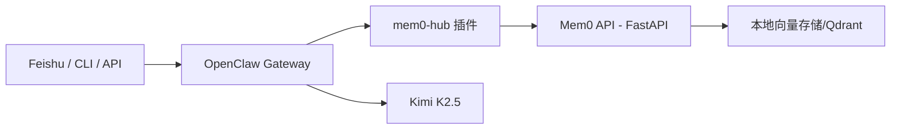

# OpenClaw-Mem0: 4G 低配服务器不失忆终极方案

<p align="center">
  <a href="https://github.com/iqvpi1024/openclaw-mem0/stargazers">
    
  </a>
  <a href="https://github.com/iqvpi1024/openclaw-mem0/network/members">
    
  </a>
  <a href="https://github.com/iqvpi1024/openclaw-mem0/blob/main/LICENSE">
    
  </a>
  
  
</p>

> 一句话：把 OpenClaw 从“容易失忆的会话机器人”，改造成“后端强制检索 + 自动回写的长期记忆体”。

## 痛点暴击

| 场景 | 传统 OpenClaw（依赖 `soul.md`/上下文） | 本项目（Mem0 第一记忆源） |
|---|---|---|
| 😵 `/new` 后连续性 | 经常像失忆，历史事实断档 | 强制先检索 Mem0，再回答 |
| 🧠 记忆持久化 | 主要靠文件或会话上下文 | 用户输入 + 模型回答双向回写 |
| 🧩 语义理解 | 文本堆积，检索弱 | 向量语义检索（`bge-large-zh-v1.5`） |
| 🔁 多端同步 | Mac / Linux / 飞书记忆割裂 | 统一 `user_id` 可跨端共享同一记忆 |
| 🐏 低配可用性 | 4G 机器容易 OOM | Swap + 单 Worker + 限并发稳定运行 |

## 架构揭秘（4G 机器也能跑）



核心机制：

1. 拦截 `message_received`，异步写入 Mem0（语义提炼后存储）。
2. 拦截 `before_prompt_build`，强制检索 Mem0 并注入 `[历史记忆：...]`。
3. 拦截 `agent_end`，把“用户问题 + AI回答”持续回写 Mem0。
4. 禁用旧 memory tools，避免走 `node:sqlite` 老路径。

## 为什么支持多环境共享记忆

可以实现，而且是本方案的重点能力。

前提只有 3 条：

1. 多个 OpenClaw 指向同一个 Mem0 后端（或本地 sidecar 转发到中心 Mem0）。
2. 全节点统一 embedding 模型版本（`BAAI/bge-large-zh-v1.5`）。
3. 全节点统一 `user_id` 归一化规则（例如 `tenant:acme:user:zhaojie`）。

这样你在 Mac 说过的话，Linux 上新会话也能被召回。

## 给 Claude Code / Codex 的直接执行方式

把下面这段直接贴给你的智能编码代理（在仓库根目录执行）：

```text
请阅读当前仓库 README.md 与 OPENCLAW_MEM0_部署与记忆优化全流程手册.md，
按文档完成以下动作：
1) 检查 openclaw + mem0 服务状态
2) 校验 openclaw.json / mem0 .env 的关键配置项
3) 执行记忆写入与检索验收命令
4) 输出当前问题与修复建议（按严重程度排序）
```

这套文档就是按“AI 代理可直接执行”的结构写的，不需要二次整理。

## 傻瓜式部署（Ctrl+C / Ctrl+V）

```bash
set -euo pipefail

git clone https://github.com/iqvpi1024/openclaw-mem0.git
cd openclaw-mem0/deploy

chmod +x *.sh
sudo bash ensure_swap_4g.sh

# 需要你提前准备好以下服务文件：
# /etc/systemd/system/ensure-swap-4g.service
# /etc/systemd/system/openclaw-gateway.service
# /etc/systemd/system/mem0-local.service

sudo systemctl daemon-reload
sudo systemctl enable --now ensure-swap-4g.service
sudo systemctl enable --now openclaw-gateway.service
sudo systemctl enable --now mem0-local.service

bash start_stack.sh
bash status_stack.sh
```

## 配置模板

`openclaw.json` 关键项：

```json
{
  "models": {
    "providers": {
      "kimicode": {
        "baseUrl": "https://api.kimi.com/coding",
        "apiKey": "<YOUR_KIMI_API_KEY>",
        "api": "anthropic-messages",
        "models": [{ "id": "kimi-k2.5", "contextWindow": 256000, "maxTokens": 8192 }]
      }
    }
  },
  "tools": {
    "deny": ["group:memory", "memory_search", "memory_get", "memory_add"]
  },
  "plugins": {
    "allow": ["mem0-hub", "feishu"],
    "slots": { "memory": "none" },
    "entries": {
      "mem0-hub": {
        "enabled": true,
        "config": {
          "mem0Url": "http://127.0.0.1:8765",
          "searchLimit": 5,
          "addTimeoutMs": 30000,
          "searchTimeoutMs": 20000
        }
      }
    }
  }
}
```

`mem0 .env` 关键项：

```env
OPENAI_API_KEY=openclaw-local
OPENAI_BASE_URL=http://127.0.0.1:18789/v1
MEM0_LLM_PROVIDER=openai
MEM0_LLM_MODEL=kimicode/kimi-k2.5
MEM0_EMBEDDER_PROVIDER=huggingface
MEM0_EMBEDDER_MODEL=BAAI/bge-large-zh-v1.5
MEM0_EMBEDDING_DIMS=1024
MEM0_QDRANT_PATH=./data/qdrant-openclaw-v2
MEM0_HISTORY_DB_PATH=./data/history-openclaw-v2.db
MEM0_COLLECTION_NAME=mem0
```

## 验收

```bash
curl -s http://127.0.0.1:8765/health
curl -s -X POST http://127.0.0.1:8765/memory/add -H 'content-type: application/json' -d '{"user_id":"diag-001","text":"我叫赵杰","infer":false}'
curl -s -X POST http://127.0.0.1:8765/memory/search -H 'content-type: application/json' -d '{"user_id":"diag-001","query":"我叫什么","limit":5}'
```

飞书验证：

1. `/new`
2. `我叫赵杰，今年25岁`
3. `我公司是扬州蜗风网络科技有限公司`
4. `我公司抬头是什么，我明年多大？`

## 已踩过的坑（你不用再踩）

1. `node:sqlite` 报错不是 Mem0 故障，是旧 memory 工具链问题。
2. `plugins.slots.memory` 不能设成 `mem0-hub`，必须是 `none`。
3. `addTimeoutMs` 超过 `30000` 会导致配置校验失败。
4. `/new` 后“失忆”通常是 `user_id` 漂移，不是数据丢失。

## 文档

- 完整部署文档：[OPENCLAW_MEM0_部署与记忆优化全流程手册.md](./OPENCLAW_MEM0_部署与记忆优化全流程手册.md)

## Star 支持

如果这个项目帮你把 OpenClaw 从“短期记忆”升级成“长期记忆”，请点一个 Star：

- ⭐ https://github.com/iqvpi1024/openclaw-mem0

## 赞赏区

为了榨干 4G 服务器性能跑通这套全自动记忆流，熬了不少大夜。  
如果这个方案治好了你的 AI 失忆症，或者帮你省下了高配服务器的钱，欢迎请我喝杯咖啡 ☕️，支持我持续维护。

| 微信赞赏 | 支付宝赞赏 |
|---|---|
|  |  |

> 把你的赞赏码图片放到：
> - `assets/donate/wechat.png`
> - `assets/donate/alipay.png`

## License

MIT
